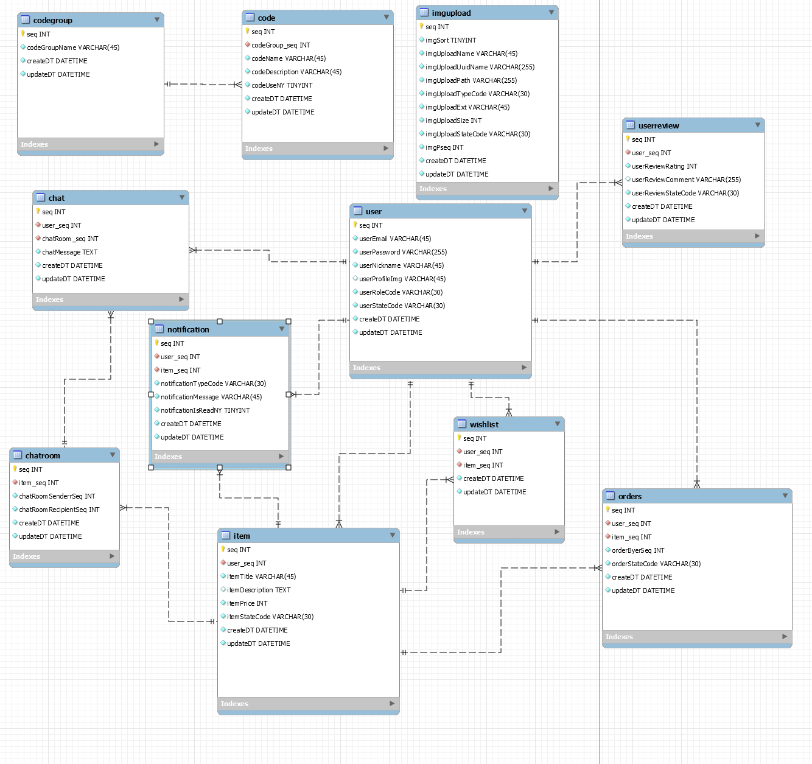

# NextUse - 중고 거래 플랫폼

# 개요

NextUse는 React 기반 SPA와 SpringBoot로 제작된 사용자 인증, 상품 등록 및 조회 기능등을 포함한 중고 거래 플랫폼의 핵심 기능을 구현한 데모 프로젝트 입니다.

## 사용 기술

-   frontend
    -   React + Vite
-   backend
    -   SpringBoot
-   database
    -   MySQL

## 주요 특징

-   SSE 기반 실시간 알림
-   JWT 기반 인증 시스템
-   이미지 업로드 서버 분리 구조
-   Dto<->Entity<->Vo간 변환을 통한 계층 간 역할 분리

## 링크

-   서비스 URL : https://nextuse.jin7942.co.kr

-   프론트: https://github.com/jin7942/used_market_frontend
-   백엔드: https://github.com/jin7942/used_market
-   이미지 업로드 서버 (독립 운영): https://github.com/jin7942/uploadServer

---

## 기술 스택

| 구성         | 기술                           |
| ------------ | ------------------------------ |
| 프론트엔드   | React, Vite, Bootstrap, Axios  |
| 벡엔드       | Spring Boot 3.x, JPA, JWT, SSE |
| 데이터베이스 | MySQL                          |
| 인프라       | Docker, Nginx, Ubuntu 20.04    |
| 공통 도구    | ModelMapper, Lombok            |

---

## 주요 기능

-   회원가입 / 로그인 (JWT 인증)
-   상품 등록/수정/삭제/조회
-   찜하기, 상품 구매
-   실시간 알림 (SSE)
-   마이페이지
-   이미지 업로드 서버 분리 운영

# 프로젝트 구조

NextUse는 SpringBoot 기반의 백엔드와 React 기반 SPA 프론트엔드, MySQL기반 db로 구성 되어 있습니다. 설계 구조의 주요 특징은 다음과 같습니다.

-   Controller / Service / Repository / DTO 계층 분리
    -   각 클래스별 책임을 분리하여 확장 및 유지보수가 용이한 구조를 사용했습니다.
-   공통 응답 포맷 ResponseVo<T> 사용
    -   응답 포맷을 통일 시켜 프론트엔드 연동 및 협업에 편리한 구조를 사용했습니다.
-   BaseEntity 공통 필드 관리
    -   생성일, 수정일 등 공통 필드는 상속을 통해 일관된 구조를 유지할 수 있도록 하였습니다.
-   공통 상수는 ENUM으로 관리
    -   공통 상수를 중앙 집중화 하여 확장 및 수정이 용이한 구조를 사용하였습니다.

## ERD

> 채팅 / 리브와 등 일부 테이블은 현재 사용되지 않으며, **차후 리리즈에 포함될 예정**



## 프로젝트 디렉터리 구조

```bash
usedmarket/
├── src/
│   └── main/
│       ├── java/com/jinfw/infra/usedmarket/
│       │   ├── common/              # 공통 유틸리티, 상수, 예외처리
│       │   │   ├── base/            # BaseEntity 등 공통 상속 엔티티
│       │   │   ├── constants/       # 공통 ENUM (공통 코드 상수 등)
│       │   │   ├── exception/       # 커스텀 예외
│       │   │   └── util/            # JWT, DTO 변환 유틸
│       │   ├── code/                # 공통 코드(Code, CodeGroup)
│       │   ├── img/
│       │   ├── item/
│       │   ├── user/                # 사용자 도메인
│       │   │   ├── controller/      # 컨트롤러 클래스
│       │   │   ├── dto/             # dto, vo
│       │   │   ├── entity/          # entity 클래스
│       │   │   ├── repository/      # jpa repository 인터페이스
│       │   │   └── service/         # 서비스 클래스
│       │   ├── orders/
│       │   └── notification/
│       └── resources/
│           └── application.yml      # 프로젝트 설정 파일
```

## API 명세

API 문서를 보실려면 다음 링크로 방문 하십시오.
https://nextuse.jin7942.co.kr/docs

## 업데이트 예정

-   실시간 채팅 (WebSocket)
-   사용자 리뷰 및 평점
-   관리자 대쉬보드
